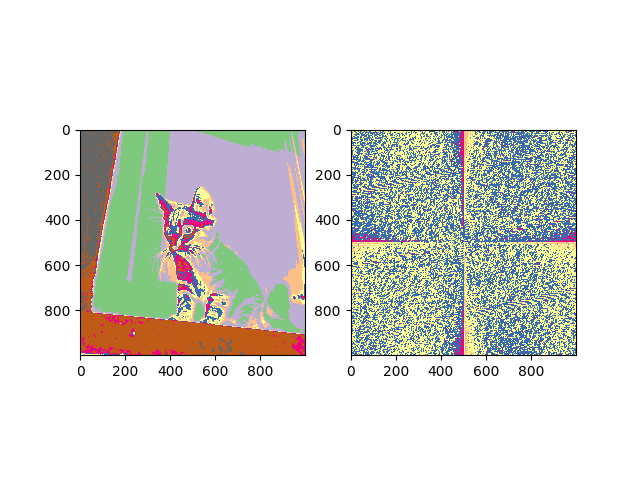

# Spectrum exporter
This program aims to export all spectrums of a picture.

## How to use
To use it you just have to change the value of the variable ```picture_path``` in ```exporter.py``` and run the program.

## Requirements
You need to have Python 3 installed on your computer.
If you don't have it, you can download it [here](https://www.python.org/downloads/).

You need to have the following libraries installed:
- numpy
- opencv-python
- os
- matplotlib

## Main use
This program is useful to extract the spectrums of a picture and use it in other programs, like the one that I'm developing to generate a color palette.
It's also useful for steganography, to find hidden messages in the spectrums of a picture.

## Example  
If the picture is a beautiful cat like that:

 </img>

The program will export the spectrums of the colors of the cat, like that:

 </img>